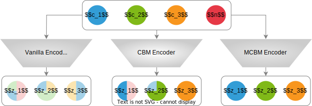

<h1 align="center">There Was Never a Bottleneck in Concept Bottleneck Models </h1>

<p align="center">
  <a href="https://arxiv.org/abs/2506.04877"></a>
  
  
</p>

<p align="center">
  <i>Official implementation of <b>There Was Never a Bottleneck in Concept Bottleneck Models</b> (Under Review)</i><br>
  <b>Antonio Almudévar</b>, José Miguel Hernández-Lobato, Alfonso Ortega
</p>


## 🌟 Overview
CBMs improve interpretability but leak extra information, limiting interventions. MCBMs add an Information Bottleneck to ensure each component encodes only its concept, yielding cleaner and more reliable representations.


<p align="center">
  
</p>

---

## 📜 Abstract
Deep learning representations are often difficult to interpret, which can hinder their deployment in sensitive applications. Concept Bottleneck Models (CBMs) have emerged as a promising approach to mitigate this issue by learning representations that support target task performance while ensuring that each component predicts a concrete concept from a predefined set. In this work, we argue that CBMs do not impose a true bottleneck: the fact that a component can predict a concept does not guarantee that it encodes only information about that concept. This shortcoming raises concerns regarding interpretability and the validity of intervention procedures. To overcome this limitation, we propose Minimal Concept Bottleneck Models (MCBMs), which incorporate an Information Bottleneck (IB) objective to constrain each representation component to retain only the information relevant to its corresponding concept. This IB is implemented via a variational regularization term added to the training loss. As a result, MCBMs yield more interpretable representations, support principled concept-level interventions, and remain consistent with probability-theoretic foundations.

---


## ⚙️ Installation
```
git clone https://github.com/antonioalmudevar/minimal_cbm.git
cd minimal_cbm
python3 -m venv venv
source ./venv/bin/activate
python setup.py develop
pip install -r requirements.txt
```
---


## 📁 Repository Structure

```
minimal_cbm/
├── bin/                       # CLI entrypoints (train/test/intervene)
│   ├── train.py
│   ├── test.py
│   └── intervene.py
├── configs/                   # YAML configs per dataset/model
│   ├── cifar10/
│   ├── cub12/
│   ├── mpi3d/
│   └── shapes3d/
├── data/                      # ti generate concepts of CIFAR
├── src/
│   ├── datasets/              # CIFAR‑10, CUB, MPI3D, Shapes3D, Spirals, CelebA
│   ├── experiments/           # train/test/intervene pipelines
│   ├── helpers/               # metrics, optim, logging, utilities
│   └── models/                # Vanilla, CBM, CEM, AR/SC/HCBM, MCBM
├── requirements.txt
└── setup.py
```

---


## 📊 Datasets

This repository includes dataset loaders and configuration presets for:

* **MPI3D**: controlled factors (object shape/color/size, camera height, background color, axes…).
* **Shapes3D**: room renders with floor/wall/object color, scale, shape, orientation.
* **CIFAR‑10**: 10 natural image classes. Concepts come from **synthetic attributes** (subset of 143) and are predicted with CLIP similarities; nuisances are the remaining attributes. To obtain the attributes use `create_dataset_cifar.py`.
* **CUB**: 200 bird species with attribute groups; we sample 12 groups as concepts and the rest as task‑related nuisances per run.
* **Spirals**: synthetic 4‑class spiral toy task used to probe OvR vs multiclass limitations.

> 🔧 **Paths**: edit dataset roots/filepaths in the YAML under `configs/**/` to match your environment.

---

## 🚀 Quickstart

All experiments are driven by a single YAML file. Choose a preset and tweak as needed.

### 🎯Train

```bash
# Example: MCBM on CIFAR‑10 with γ=0.3
python bin/train.py configs/cifar10/cifar10-mcbm-03.yaml -s 42

# Baselines
python bin/train.py configs/cifar10/cifar10-vanilla.yaml   -s 42
python bin/train.py configs/cifar10/cifar10-cbm.yaml       -s 42
python bin/train.py configs/cifar10/cifar10-cem.yaml       -s 42
python bin/train.py configs/cifar10/cifar10-arhcbm.yaml    -s 42
python bin/train.py configs/cifar10/cifar10-shcbm.yaml     -s 42
```

Checkpoints, logs, and metrics are written under the experiment’s output directory (see `src/experiments/base.py`). Weights & Biases support can be toggled in `TrainExperiment.wandb_offline`.

### 🧪 Test / Metrics

```bash
python bin/test.py configs/cifar10/cifar10-mcbm-03.yaml -s 42
```

Reports standard classification metrics and additional CBM‑style scores (e.g., concept accuracy), plus calibration (`ECE`, `Brier`) and retrieval/linear‑probe utilities via `src/helpers`.

### 🔧 Interventions

```bash
# Concept‑level interventions per the selected model
python bin/intervene.py configs/cifar10/cifar10-mcbm-03.yaml -s 42
```

* **CBM/HCBM/AR/SCBM** use their respective intervention procedures.
* **MCBM** performs interventions via the learned $q_\phi(z_j\,|\,c_j)$, consistent with Bayes.

---

## 📑 Reproducing Paper Experiments

Below are pointers to the closest configuration presets used in the paper experiments. You may adjust seeds, γ, and training lengths to match plots.

### MPI3D / Shapes3D

* Task: object/shape classification.
* Concepts: remaining generative factors.
* Nuisances: `n_y` (task‑related) and `n_\bar y` (task‑unrelated) as defined in the loaders.
* Presets: `configs/mpi3d/*.yaml`, `configs/shapes3d/*.yaml`.

### CIFAR‑10

* Concepts: **64** attributes out of **143** synthetic attributes; remaining form `n_y`.
* Presets: `configs/cifar10/cifar10-*.yaml` (use `mcbm-01/03/05` for γ∈{0.1,0.3,0.5}).

### CUB

* Concepts: 12 randomly selected attribute groups per run; remaining 20 groups as `n_y`.
* Presets: `configs/cub12/cub12-*.yaml` (γ presets analogous to CIFAR‑10).

---

## 🛠️ Configuration Reference

A minimal YAML has three blocks: `data`, `model`, `training`.

```yaml
# Example: configs/cifar10/cifar10-mcbm-03.yaml

data:
  dataset: cifar10
  root: /path/to/cifar10
  n_concepts: 64

model:
  model_type: mcbm            # one of: vanilla, cbm, cem, arhcbm, scbm, shcbm, mcbm
  encoder:
    arch: conv2d              # encoders: conv2d | cifar_resnet | mlp | vit ...
    latent_dim: 256
  hidden_dims_y: 64           # task head width
  var_z: 1.0                  # encoder variance (MCBM uses stochastic encoders)
  hidden_dims_c: [3]          # concept head MLP (CBM/MCBM)
  beta: 0.1                   # weight on concept prediction loss
  hidden_dims_z: null         # representation head MLP (MCBM)
  gamma: 0.3                  # **MCBM’s IB strength**

training:
  batch_size: 128
  n_epochs: 200
  save_epochs: 200
  optimizer:
    optimizer: Adam
    base_batch_size: 64
    base_lr: 1.0e-4
    batch_size: 128
    weight_decay: 4.0e-5
  scheduler:
    scheduler: StepLR
    step_size: 80
    gamma: 0.1
```

Key notes:

* **γ (gamma)** controls the IB strength in MCBM; higher values tighten the bottleneck.
* **β (beta)** scales the concept prediction objective.
* **Encoders** available under `src/models/encoders/` (Conv2D, ResNet20 for CIFAR/MPI3D, ViT option, etc.).
* **Baselines** live in `src/models/` (`cbm.py`, `cem.py`, `hcbm.py`, `scbm.py`, `vanilla.py`, and `mcbm.py`).

---

## 📈 Results & Metrics

The helpers in `src/helpers/` provide:

* **Classification**: accuracy, macro/micro scores.
* **Calibration**: Expected Calibration Error (**ECE**), **Brier** score.
* **Linear probes / retrieval**: utilities for CKA/disentanglement analyses and nuisance leakage proxies (URR).

---

## 📚 Citing

```bibtex
@article{almudevar2025there,
    title={There Was Never a Bottleneck in Concept Bottleneck Models},
    author={Almud{\'e}var, Antonio and Hern{\'a}ndez-Lobato, Jos{\'e} Miguel and Ortega, Alfonso},
    journal={arXiv preprint arXiv:2506.04877},
    year={2025}
}
```